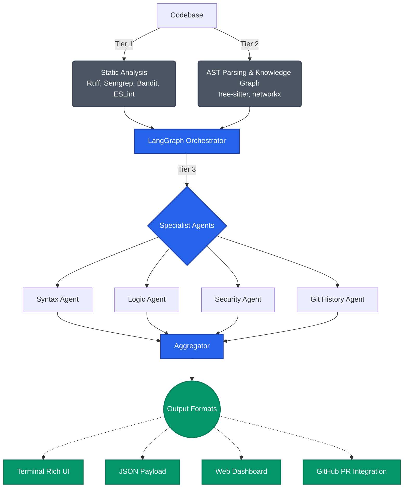

<p align="center">
  
</p>

# CodeNexus

> **Next-Gen Code Review: Where Static Analysis Meets Graph-Aware AI Agents.**

[](https://www.python.org/downloads/)
[](LICENSE)
[](#)

## Overview

Traditional linters lack context, and standard LLMs struggle with large codebases. **CodeNexus** solves this by fusing deterministic static analysis with specialized AI agents powered by LangGraph. Instead of feeding raw file dumps to an LLM, CodeNexus builds a comprehensive Abstract Syntax Tree (AST) driven knowledge graph of your project. This provides our agents with precise, topology-aware context resulting in faster, cheaper, and highly accurate code reviews.

## Key Highlights

*   **Topology-Aware Context:** Uses `tree-sitter` and `networkx` to build a graph of module imports, call chains, class inheritance, and developer rationale comments.
*   **Tiered Hybrid Analysis:** Combines the speed of traditional tools (Ruff, Semgrep, Bandit, ESLint) with the reasoning capabilities of specialized LLMs (Syntax, Logic, Security, Git History).
*   **Local-First Architecture:** Run completely locally using LM Studio for zero-data-leakage privacy, or scale up with remote APIs like NVIDIA NIM, Groq, and Cerebras.
*   **Multi-Format Reporting:** Review findings via rich terminal output, JSON payloads, automated GitHub PR comments, or the built-in live Web Dashboard.

## Architecture



## Installation

CodeNexus requires Python 3.11+.

**Standard Installation:**
```bash
# Clone the repository
git clone https://github.com/lyeswanthp/CodeNexus.git
cd CodeNexus

# Install minimal dependencies
pip install -e "."
```

**Full Installation (Includes external Tier 1 analyzers):**
```bash
pip install -e ".[full]"
```

**Development Installation:**
```bash
pip install -e ".[dev]"
```

## Configuration

Copy the example environment file and adjust the settings to your preferred LLM provider.

```bash
cp .env.example .env
```

**Example `.env` configuration:**
```env
# Runtime Environment
LLM_MODE=local                                    # "local" or "remote"
SEVERITY_THRESHOLD=medium                         # low | medium | high | critical

# Local Model Settings (LM Studio)
LMSTUDIO_BASE_URL=http://localhost:1234/v1
LMSTUDIO_HEAVY_MODEL=qwen2.5-coder-14b-instruct
LMSTUDIO_LIGHT_MODEL=mistral-7b-instruct-v0.3

# Remote Provider Keys (Required only if LLM_MODE=remote)
NVIDIA_API_KEY=nvapi-...
GROQ_API_KEY=gsk_...
CEREBRAS_API_KEY=csk-...
```

## Usage Guide

CodeNexus operates entirely via the `code-review` CLI.

**Basic Review:**
Scan the current directory filtering for medium and higher severity issues.
```bash
code-review review --path . --severity medium
```

**Commit-Aware Review:**
Compare changes in the current branch against its parent commit to focus only on new code.
```bash
code-review review --path . --repo . --sha HEAD
```

**Machine-Readable JSON Output:**
```bash
code-review review --path . --format json
```

**CI/CD Pipeline (GitHub Integration):**
Generate a GitHub payload without submitting it (ideal for dry-runs).
```bash
code-review review --path . --format github --gh-owner ORG --gh-repo REPO --gh-pr 123
```

> **Note:** A live web dashboard starts on port `9120` by default during each review session. To disable this, use `--dashboard-port 0`.

## Contributing

We welcome contributions!

To run the test suite:
```bash
python -m pytest -q
```

## License

This project is licensed under the terms of the MIT License. See the [LICENSE](LICENSE) file for details.
